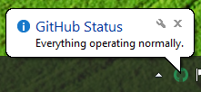
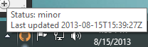
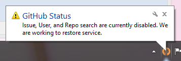
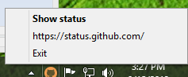

# ahk-github-status
A simple tray-icon app to check GitHub's status.
Uses the GitHub Status API at https://status.github.com/api

To use, just download and run the executable.

## Disclaimer
This software is not endorsed or supported by GitHub in any way.

## Screenshots

## License
### ahk-syslog-app.ahk
Distributed under a BSD-New (BSD 3-clause) license.
### lib\json.ahk
Distributed under a Simplified BSD license, copyright (c) Titan.
### img\\*
Copyright (c) GitHub. See https://github.com/logos for more information.

